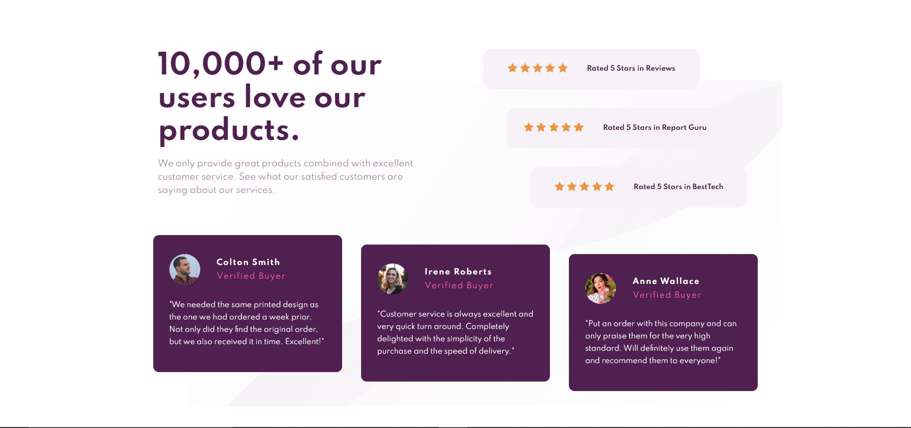
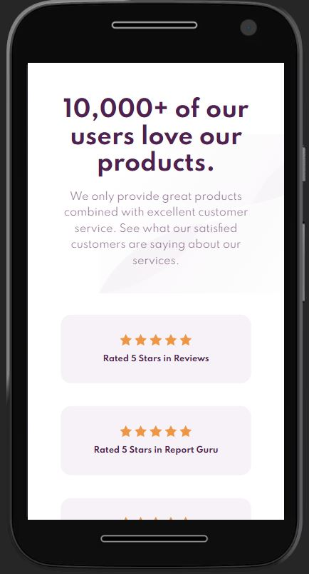
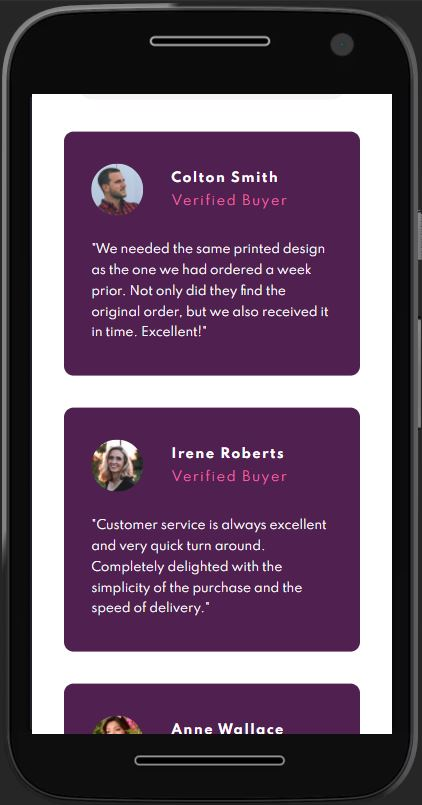

# Frontend Mentor - Social proof section solution

This is a solution to the [Social proof section challenge on Frontend Mentor](https://www.frontendmentor.io/challenges/social-proof-section-6e0qTv_bA). Frontend Mentor challenges help you improve your coding skills by building realistic projects.

## Table of contents

- [Overview](#overview)
  - [The challenge](#the-challenge)
  - [Screenshot](#screenshot)
  - [Links](#links)
- [My process](#my-process)
  - [Built with](#built-with)
  - [What I learned](#what-i-learned)
  - [Useful resources](#useful-resources)
- [Author](#author)
- [Acknowledgments](#acknowledgments)

## Overview

### The challenge

Users should be able to:

- View the optimal layout for the section depending on their device's screen size

### Screenshot

### Links

- Solution URL: [Add solution URL here](https://your-solution-url.com)
- Live Site URL: [Add live site URL here](https://your-live-site-url.com)

## My process

### Built with

- Semantic HTML5 markup
- CSS custom properties
- Flexbox
- CSS Grid

### What I learned

Learnt How to layout webpages using CSS Grid and using grid in responsive web pages.

### Useful resources

- [Grid CSS](https://developer.mozilla.org/en-US/docs/Web/CSS/CSS_Grid_Layout) - This helped me to get familiar with CSS Grid and its properties.
- [Flexbox](https://developer.mozilla.org/en-US/docs/Learn/CSS/CSS_layout/Flexbox) - This helped me to get familiar with Flexbox and its properties.

## Author

- LinkedIn - [@Sai Chandra](https://www.linkedin.com/in/sai-chandra-065101152/)
- Frontend Mentor - [@SaiChandra2896](https://www.frontendmentor.io/profile/SaiChandra2896)
- Twitter - [@saichan58535512](https://twitter.com/saichan58535512)

## Acknowledgments

I would Like to thank Front-end Mentor Team for giving me this oppurtunity.
